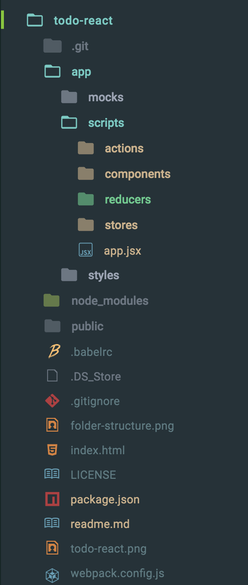

# Todo: Using React, Flux and JSX

- Webpack module bundler is used to resolve dependencies
- Babel to convert REACT and ES6 code into browser compatible version and
- Used Redux pattern to organize code

(Converted earlier done based on flux pattern)

## To run application

1. Clone this application from git
1. Resolve dependencies run command "npm install" in cmd/terminal
1. Next generate assets used by application run command "num run serve"
1. This will watch and serve your application using webpack-dev-server
1. In browser hit url http://localhost:2020
1. After your change is complete just refresh the browser to reflect changes

## How application is structured

- package.json holds application dependencies and run configuration
- Webpack pack configuration in <a href='webpack.config.js'>webpack.config.js</a>
- <a href='.bablerc'>.bablerc</a> configuration used to compile application into ES5
- React component and styles resides in app/
- jsx will be compiled into public/scripts/app.js
- index.html is the main html file in root directory which is loaded when you run the application
- Provider is app/app.jsx which binds stores to components

## App Snapshot

